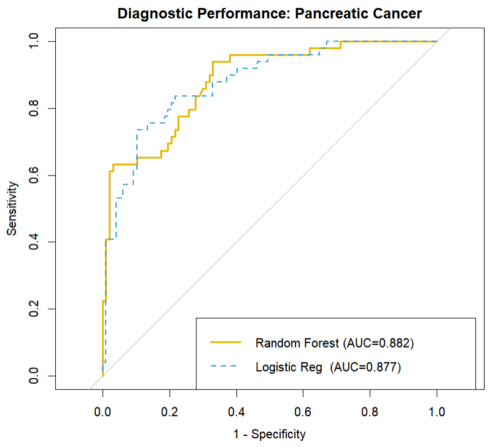
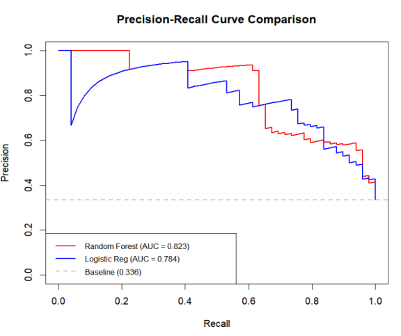

#  R Package

## Project Background

This R package is a deliverable of the BIO215 Bioinformatics Capstone Project, designed to predict pancreatic cancer risk using machine learning techniques.

## Project Team

| Role | Name | Student ID | Responsibilities |
|------|------|------------|-----------------|
| Machine Learning Modeler | Yichen Tang | 2364584 | Model Training & Performance Evaluation |
| Shiny Website Developer | Yinuo Feng | 2362371 | Database & Prediction Module Development |
| R Package Developer | Yuhui Dong | 2363895 | Package Construction & Documentation Management |

## Installation

Install directly from GitHub:

```R
# Install remotes package if not already installed
if (!require("remotes")) install.packages("remotes")

# Install from GitHub
remotes::install_github("Yuhui-xjtlu/Bio215G25")
)
```
# Key Features
1.Data Preprocessing
2.Pancreatic Cancer Risk Prediction
3.Model Performance Evaluation

## Usage Example
```R
library(Bio215G25)

# Data Preprocessing
processed_data <- preprocess_pancreatic_data(your_data)

# Load Model
model <- load_pancreatic_model()

# Single Patient Prediction
result <- predict_single_patient(
  age = 65, 
  sex = "M", 
  creatinine = 1.2, 
  LYVE1 = 18.5, 
  REG1B = 75.0, 
  TFF1 = 250.0
)
```
## Dependencies
R (>= 4.0)
caret
dplyr

## Project Highlights
Provides pancreatic cancer risk prediction
Supports single and batch predictions
Includes comprehensive data preprocessing module

## Future Roadmap
Optimize machine learning model
Expand feature engineering
Improve predictive performance

## License

MIT License


Permission is hereby granted, free of charge, to any person obtaining a copy
of this software and associated documentation files (the "Software"), to deal
in the Software without restriction, including without limitation the rights
to use, copy, modify, merge, publish, distribute, sublicense, and/or sell
copies of the Software, and to permit persons to whom the Software is
furnished to do so, subject to the following conditions:

The above copyright notice and this permission notice shall be included in all
copies or substantial portions of the Software.

THE SOFTWARE IS PROVIDED "AS IS", WITHOUT WARRANTY OF ANY KIND, EXPRESS OR
IMPLIED, INCLUDING BUT NOT LIMITED TO THE WARRANTIES OF MERCHANTABILITY,
FITNESS FOR A PARTICULAR PURPOSE AND NONINFRINGEMENT. IN NO EVENT SHALL THE
AUTHORS OR COPYRIGHT HOLDERS BE LIABLE FOR ANY CLAIM, DAMAGES OR OTHER
LIABILITY, WHETHER IN AN ACTION OF CONTRACT, TORT OR OTHERWISE, ARISING FROM,
OUT OF OR IN CONNECTION WITH THE SOFTWARE OR THE USE OR OTHER DEALINGS IN THE
SOFTWARE.

## Project URLs
Shiny App: https://yinuofeng.shinyapps.io/BIO215_G25_shinyapp/
GitHub Repository: https://github.com/Yuhui-xjtlu/Bio215G25






 


